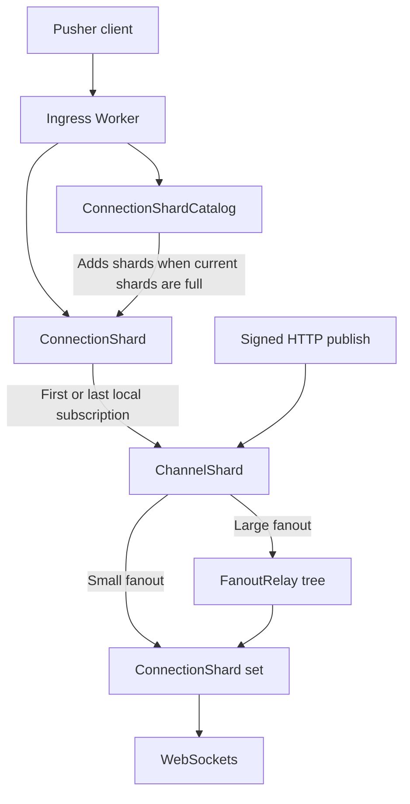

# Durable Object architecture

## Goals

- Use one Pusher-compatible WebSocket for each client.
- Let each client change its subscriptions after it connects.
- Add connection shards automatically.
- Do not set a connection limit for the complete application.
- Send an event only to connection shards that have subscribers.
- Do not write ordinary connection, subscription, presence, or publish data to SQLite.
- Write only control state, channel state changes, and cache values to SQLite.

## Object layout

One Cloudflare Worker receives all requests. It exports these six Durable Object classes:

- `AppRegistry`
- `ConnectionShardCatalog`
- `ConnectionShard`
- `ChannelShard`
- `FanoutRelay`
- `ChannelDirectoryShard`

Cloudflare can put each object in a different location.

The classes share one Worker script. They do not share execution, storage, placement, or request
order.

## Automatic connection sharding

The catalog initially contains one connection shard. The Worker checks a maximum of eight shards.
A full shard rejects a new WebSocket before it accepts the socket. The
`PUSHER_CONNECTION_SHARD_SOFT_LIMIT` value specifies when a shard is full.

If all checked shards are full, the catalog doubles the shard range in one operation. The Worker
then sends retries to the new range. The service does not move existing WebSockets.

The soft limit is an operating target. It is not a connection limit for the complete application.
The service adds named Durable Objects to increase capacity. If you decrease the target, existing
sockets stay in their current shards. These shards become empty when clients disconnect.

## Connection state

`ConnectionShard` uses the hibernation API. The WebSocket attachment stores the current state:

- socket and application identity
- signed-in user identity
- subscriptions and presence data
- the client-event rate window for the connection

Cloudflare limits each attachment to 16,384 bytes. After a shard wakes, it rebuilds its memory
indexes from the attachments. Cloudflare removes an attachment when its socket closes. Thus,
connection cleanup does not delete SQLite rows.

The WebSocket auto-response function answers standard Pusher ping frames. These ping frames do not
wake the connection shard. If you disable or delete an application, the service starts to close its
connections. The control request completes after all connection shards process the close requests.

## Channel registration

`idFromName(app_id + channel)` selects one channel shard. The `channel_gateways` table has one row
for each connection shard that has a subscriber for the channel.

- For local count `0 -> 1`, insert one gateway row.
- For each additional local subscriber, do not write a row.
- For local count `1 -> 0`, delete the gateway row.
- For a publish operation, do not write a row.

A registration token identifies each registration period. The token prevents an old operation from
deleting a new registration. The service confirms a subscription only after initial registration is
complete.

The shard keeps events in memory while a subscription joins. It sends these events after
`subscription_succeeded`. The service calculates subscription counts from attachments. It does not
store a count for each socket.

Each connection shard limits its total subscription backlog to 8 MB. If a new event causes the
backlog to exceed this limit, the shard closes the affected socket.

## Event delivery

The channel shard reads the registered connection shard names. It sends directly to a small set of
connection shards. For a large set, it calls a stateless relay. Each relay divides its target list
into smaller lists. Thus, each object calls a limited number of other objects.

Relays do not store topology or events.

The service does not guarantee delivery of ordinary events. It sends each ordinary event a maximum
of one time. It does not use a durable outbox, receipt, retry, or replay. It does not write a sequence
value for each subscriber. The channel shard sends publish operations in sequence while it is active.

Cache channels use a different process. The channel shard writes the latest server event before
delivery. It sends this event to new subscribers until the event expires.

Subscription count notifications run from a channel alarm. The connection shard requests an update
and does not wait for count collection or delivery. Thus, count delivery does not call back into the
connection request that caused it. Concurrent requests can use one notification with the latest exact
count. Above 100 subscribers, the channel sends at most one count notification every five seconds
while subscriptions change.

## Presence

The service reads presence state from subscription attachments in registered connection shards.
The service does not set a server-side member limit. It sends `member_added` for the first connection
of a user. It sends `member_removed` after the last connection of a user closes.

Count and presence operations use the same relay structure as event delivery. The standard Pusher
presence handshake sends the complete member list in one frame. A large member list can exceed frame,
memory, or client limits. A paginated member list requires a protocol extension.

## Calculated data

Channel directory shards store only two changes. They store when a channel gets its first subscriber.
They also store when a channel loses its last subscriber. If an HTTP request asks for exact counts,
the service reads all registered connection shards through relays.

User termination also uses relays to read the current connection shards. The service does not store
a persistent user index.

## Placement and scaling limits

You cannot change application placement after application creation. The service uses this placement
for each object lookup. One channel shard controls the order for one channel. Therefore, the request
rate of one channel shard limits a busy channel. More ordering lanes can increase the publish rate,
but they cannot keep one global event order.

Cloudflare has these limits:

- About 1,000 requests each second for one Durable Object
- A maximum of 32,768 hibernating WebSockets for one object
- A maximum of 16,384 bytes for one WebSocket attachment
- A maximum of 128 MB for one isolate
- A maximum of 10 WebSocket tags

Use a lower operating target than the WebSocket maximum. Ten tags cannot identify all subscriptions
that clients add after connection.

Sources:

- <https://developers.cloudflare.com/durable-objects/platform/limits/>
- <https://developers.cloudflare.com/durable-objects/best-practices/websockets/>
- <https://developers.cloudflare.com/durable-objects/api/state/>
